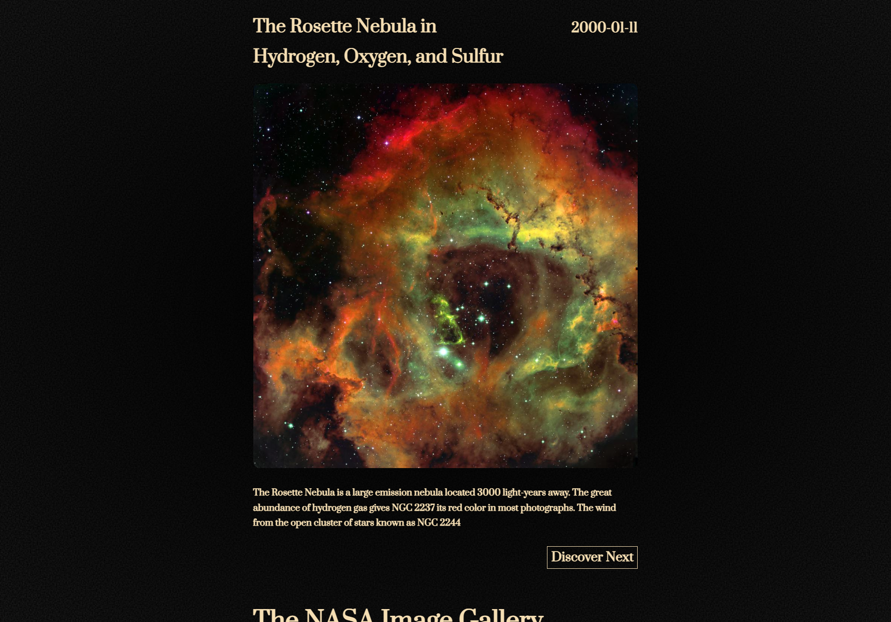
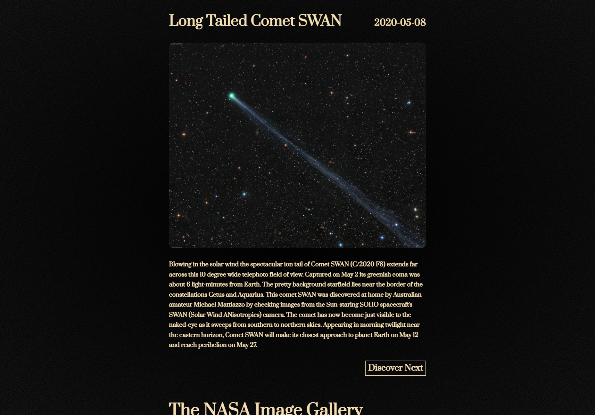
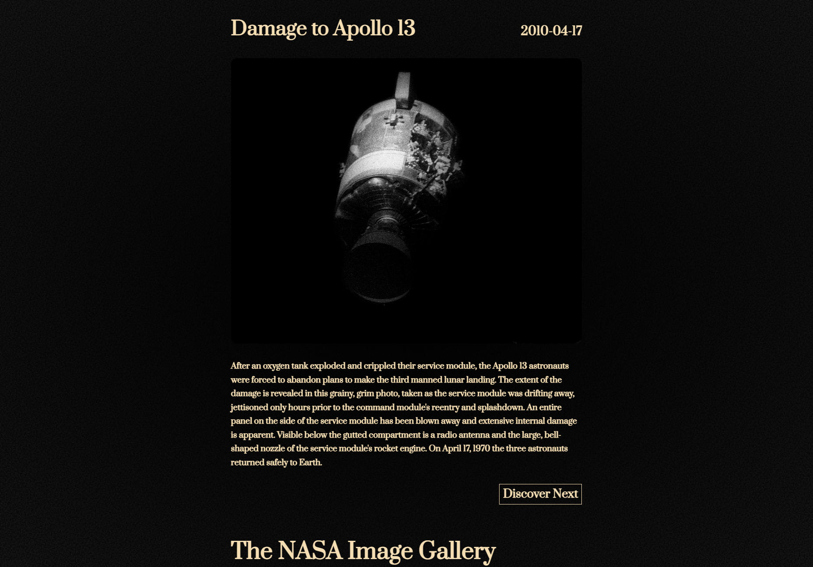
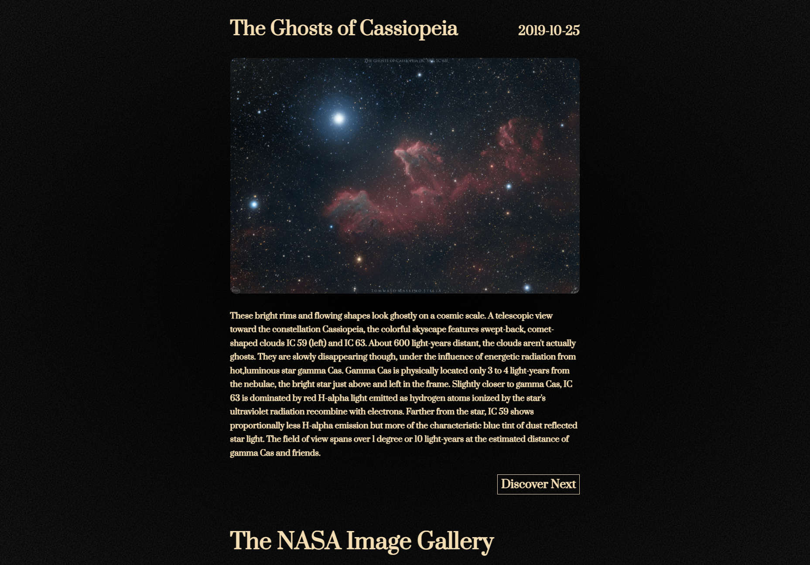
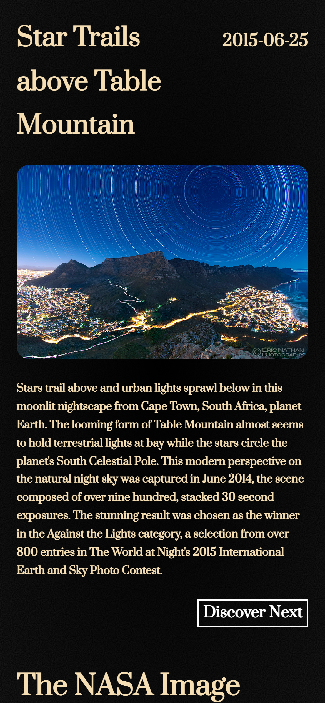

<!-- Improved compatibility of back to top link: See: https://github.com/othneildrew/Best-README-Template/pull/73 -->

<!-- PROJECT LOGO -->
 

  <a href="https://github.com/plumsily/nasa-image-app">🪐
  </a>

<h3 align="center">The NASA Image Gallery</h3>

  

    This page serves high quality images via NASA's Astronomy Picture of the Day API. Viewers can see the thousands of images NASA has to offer via the discover button. Inspired by vintage National Geographic catalogs.
     
    <a href="https://github.com/plumsily/f1-new-tab"><strong>Explore the docs »</strong></a>
     
     
    <a href="https://plumsily.github.io/nasa-image-app/"><strong>View Demo</strong></a>
  

<!-- TABLE OF CONTENTS -->

  
Table of Contents

  <ol>
    <li>
      <a href="#about-the-project">About The Project</a>
      <ul>
        <li><a href="#built-with">Built With</a></li>
      </ul>
    </li>
    <li><a href="#images">Images</a></li>
    <li><a href="#acknowledgements">Acknowledgements</a></li>
    <li><a href="#contact">Contact</a></li>
  </ol>

<!-- ABOUT THE PROJECT -->

## About The Project

This app was inspired by the NASA Astronomy Picture of the Day API and is mainly designed to serve the pictures/videos in a fun and interesting way. Taking cues from vintage National Geographic magazines, I added a grainy background texture via svg overlays. The user can use the discover button to shuffle among all the images in NASA's database.

(<a href="#readme-top">back to top</a>)

### Built With

- Javascript
- HTML/CSS

(<a href="#readme-top">back to top</a>)

<!-- USAGE EXAMPLES -->

## Images

 

 

 
Mobile version:

 

(<a href="#readme-top">back to top</a>)

<!-- ACKNOWLEDGEMENTS -->

## Acknowledgements

<a href="https://api.nasa.gov/">NASA API</a> for all images/videos.

(<a href="#readme-top">back to top</a>)

<!-- CONTACT -->

## Contact

Justin Lee - [@plumsily](https://twitter.com/plumsily)

Project Link: [https://github.com/plumsily/nasa-image-app](https://github.com/plumsily/nasa-image-app)

(<a href="#readme-top">back to top</a>)

